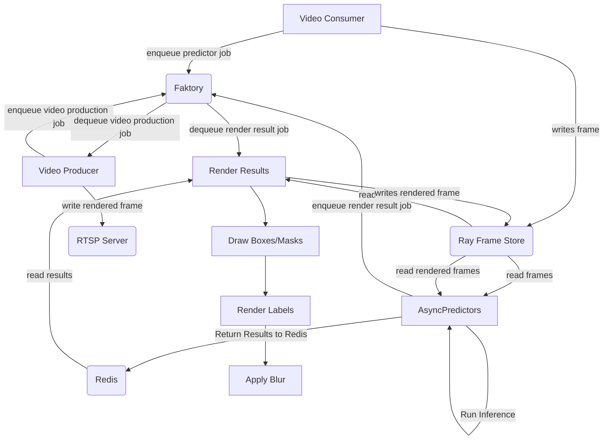

```mermaid
graph TD
    F(Faktory)
    R(Redis)
    RFB(Ray Frame Store)
    RTSP(RTSP Server)

    CV[Video Consumer] 
    CV--> |writes frame| RFB
    CV --> |enqueue predictor job| F
    
    AP[AsyncPredictors]
    RFB --> |read frames| AP
    AP --> |Run Inference| AP
    AP --> |Return Results to Redis| R
    AP --> |enqueue render result job| F
    
    RR[Render Results]
    F --> |dequeue render result job| RR
    R --> |read results| RR
    RFB --> |read frames| RR
    RR --> DBM[Draw Boxes/Masks]
    DBM --> RL[Render Labels]
    RL --> AB[Apply Blur]
    RR--> |writes rendered frame| RFB
    VP --> |enqueue video production job| F

    VP[Video Producer]
    F --> |dequeue video production job| VP
    RFB --> |read rendered frames| AP
    VP --> |write rendered frame| RTSP
```