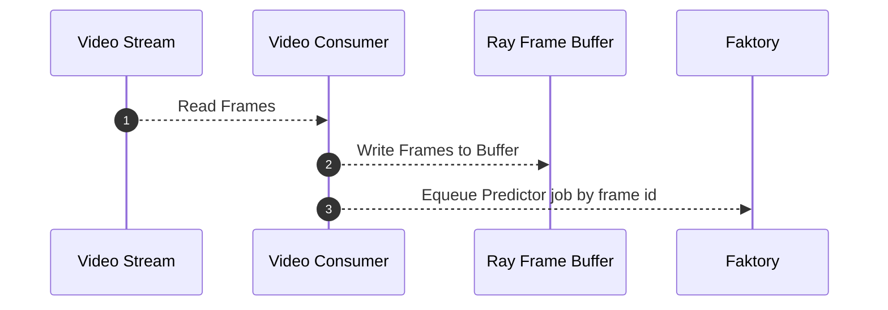
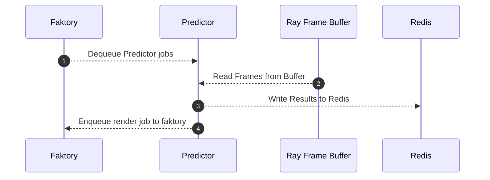
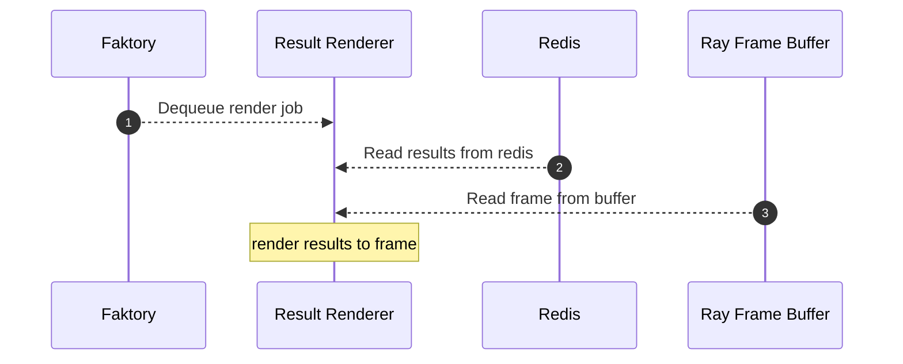
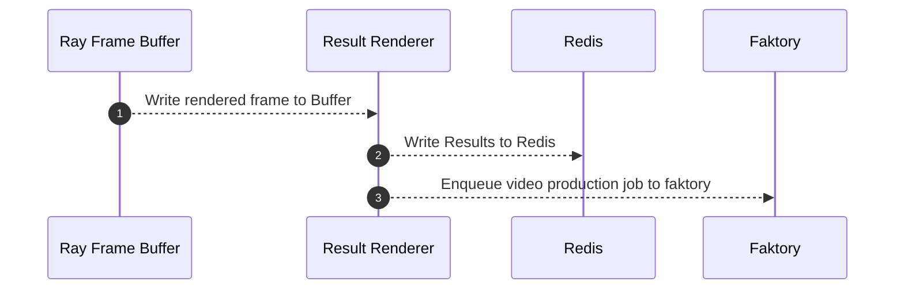
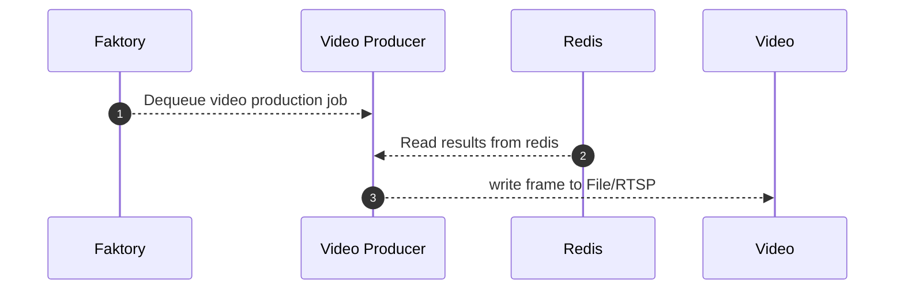
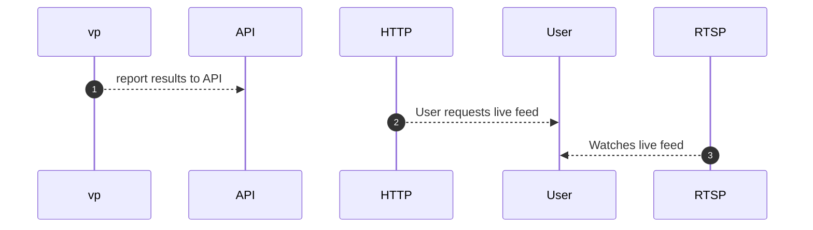
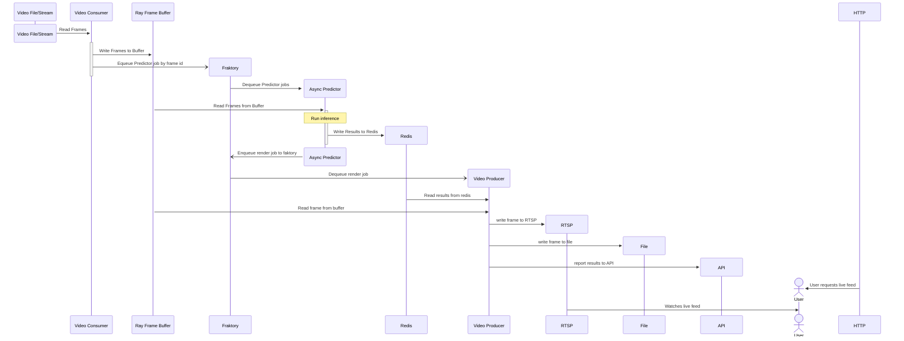

# VisorCV 
## The premier Computer Vision Application Framework

### Why VisorCV?
Building real-time computer vision applications presents a common set of challenges for developers. This framework is designed to handle the common tasks and let you focus on building your product.

### How does it work?
Just like a web application framework abstracts away the common HTTP implementation, VisorCV provides the core set of APIs required to build your computer vision app. All with best practices and high performance in mind so you don't have to worry about dropping frames or lagging behind. Just focus on your computer vision algorithms and busines logic and let VisorCV handle the rest.

:simple-ffmpeg:
:simple-gstreamer:
:simple-nvidia:
:simple-onnx:
:simple-opencv:
:simple-python:
:simple-pytorch:
:simple-raspberrypi:
:simple-ray:
:simple-redis:
:hugging:

### What is it?
VisorCV provides the best developer experience to develop any computer vision application. Building on top of the leading computer vision ([OpenCV](https://opencv.org/)) and machine learning ([PyTorch](https://pytorch.org/)) libraries, supporting a number of runtimes ([ONNXRuntime](https://onnxruntime.ai/docs/execution-providers/), [Hugging Face](https://huggingface.co/models?sort=trending&search=onnx)), and pretrained/custom models ([YOLOv8](https://github.com/ultralytics/ultralytics), [Detectron2](https://github.com/facebookresearch/detectron2)) all with scalable deployment in mind ([Docker](https://www.docker.com/)). VisorCV will get your product ready for production in no time.

## Install

### Pip
```
pip install visorcv
```
### Docker
```
docker pull visorml/visorcv:latest
```

## Getting Started
### Create a computer vision app
Create a new computer vision application named `cv-project`.
```
visorcv new cv-project
```

### Project layout
``` 
project-name/
├─ app/
│  ├─ consumers/
│  │   └─ camera_stream.py
│  ├─ models/
│  │  └─ yolov8n.onnx
│  ├─ predictors/
│  │  └─ yolo_detector.py
│  └─ views/
│     └─ blurred_faces.py
├─ config/
│  ├─ cameras.yml
│  └─ mkdocs.yml
├─ tests/
│  ├─ consumers
│  └─ mkdocs.yml
└─ requirements.txt
```
videos -> readers => frames -> predictors => results -> renderingss => frames -> writers => videos

## Features
- Readers 
    - VideoReader
- Writers (Producer since it produces files/RTSP streams? But it consumes from frame streams...)
    - FileWriter()
    - StreamWriter(Broadcaster)
- [Predictors](#predictors)
    - Detector
    - Segmentor
    - Classifier
    - Tracker
- Results
    - Detection
    - Segementation
    - Classification
    - Tracklet
- Annotators(Views?)
    - Box
    - Mask
    - Label
    - Blur
- Model
- Transformer
  
## Integrations
### PyTorch
#### 
``` py
 model = torch.hub.load('ultralytics/yolov5', 'yolov5s', pretrained=True) # (1)
```

1.  :man_raising_hand: I'm a code annotation! I can contain `code`, __formatted
    text__, images, ... basically anything that can be written in Markdown.
### Hugging Face
```
from huggingface_hub import hf_hub_download
```
### Ray

## Predictors
Predictors are inference classes that take `image_data` and output disignated `results` that can be annotated based on the `result`
- YOLOv8
- Custom ONNX or PyTorch Models

### Video Consumer


### Predictor


### ResultRenderer: Renders results

### ResultRenderer: Enqueues video production


### VideoProducer: Produces video files and streams






### Generate inference classes
These generators will create the appropriate python code and download the supporting models.

Generate a Detector from an off the shelf model
```
visorcv generate detector --model=yolov8
```
Generate a detector for a customer model
```
visorcv generate detector --model=path/to/your/model.onnx
```
Generate a Segmentor from an off the shelf model
```
visorcv generate segmentor --model=yolov8
```
Generate a Classifier from an off the shelf model
```
visorcv generate classifier --model=yolov8
```

**Supported Models**

- PyTorch
- ONNXRuntime
    - CoreML models
    - TensorRT models

Generate a Tracker from an off the shelf model
```
visorcv generate tracker --model=bytetracker --config=botsort.yaml
```

**Supported Trackers**
  - [BoT-SORT](https://github.com/NirAharon/BoT-SORT) - Use botsort.yaml to enable this tracker.
  - [ByteTrack](https://github.com/ifzhang/ByteTrack) - Use bytetrack.yaml to enable this tracker.

### Updating models

## Roadmap

### Optimizations
- [ ] BetterTransformer for multiGPU inference?

### Offline/Cloud Platforms
- [ ] Metaflow?

### Platforms
- [ ] MacOS Apple Silicon Support with [CoreMLTools](https://github.com/apple/coremltools)

### Docker Images
- [ ] NVIDIA GPU support with CUDA, CuDNN, PyTorch, and ONNXRuntime

### Distributed Platforms
- [ ] Ray Object Store
- [ ] Docker Swarm

### Embedded Platforms
- [ ] Raspberry Pi support 
    - [ ] Disk image
    - [ ] Docker image
    - [ ] Reading from Pi Cam
    - [ ] Streaming via RTSP
- [ ] Jetson support
    - [ ] Disk image
    - [ ] Docker image
